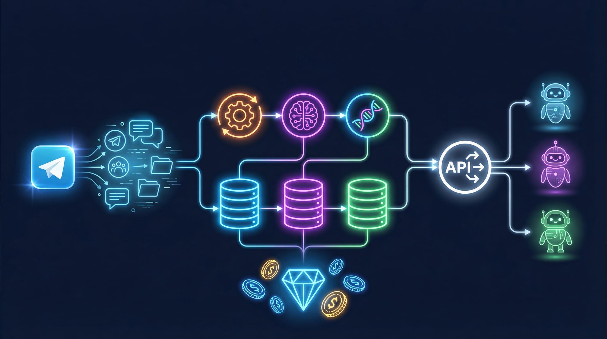
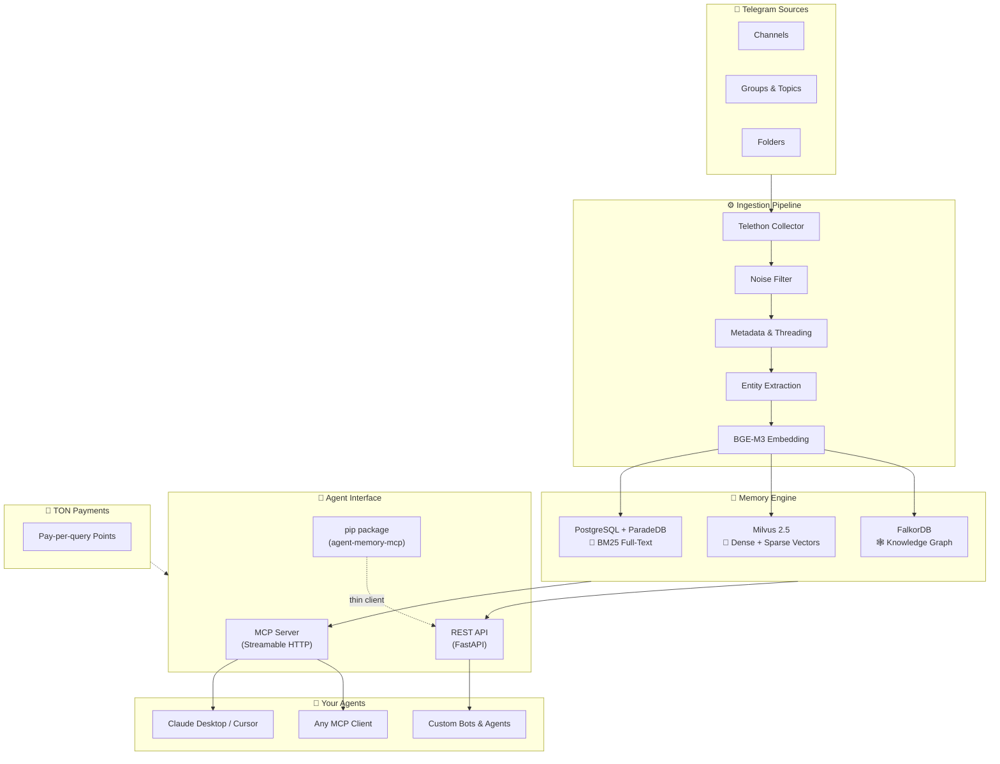

<div align="center">



# 🧠 Agent Memory MCP

**Persistent memory layer for Telegram AI agents**

Connect your channels and chats — your agent will never forget.

[](https://python.org)
[](LICENSE)
[](https://modelcontextprotocol.io)
[](https://ton.org)
[](https://hub.openclaw.com/skills/agent-memory)

[🤖 Telegram Bot](https://t.me/AgentMemoryBot) · [📦 PyPI Package](https://pypi.org/project/agent-memory-mcp/) · [🐾 OpenClaw Skill](#-openclaw-skill) · [🔌 API](#-quick-start) · [🔍 Search Architecture](#-search-architecture)

</div>

---

## ❓ What is this?

Agent Memory MCP gives any AI agent access to your Telegram history — without stuffing everything into the context window.

Here's how it works:

1. **You connect your Telegram account** through [@AgentMemoryBot](https://t.me/AgentMemoryBot)
2. **You pick which sources to remember** — channels, groups, entire folders, or specific topics
3. **The system indexes everything** — downloads message history (configurable depth: 1 month to years), extracts entities, builds a knowledge graph
4. **You plug in your AI agent** — via MCP protocol (`pip install agent-memory-mcp`) or REST API with an API key
5. **Your agent works with the full history** — search, digests, decisions, context packages — all server-side, no context window limits

Your data stays on the server. The agent only gets what it asks for — relevant search results, structured summaries, or extracted decisions. Not the raw firehose.

---

## 🎯 What You Can Do

### 🔬 Deep Research

Search across years of channel history. Find specific facts, nuances, and posts by keywords. Analyze hundreds of posts on a topic with automatic map-reduce.

> *"Find all posts about wallet integration from the last year and extract key decisions"*
>
> *"What did @alice say about the migration plan in March?"*
>
> *"Analyze all discussions about performance issues across our dev channels"*

The system doesn't just keyword-match — it understands semantics, follows entity relationships in the knowledge graph, and can process 500+ posts through LLM-powered analysis in a single query.

### 📋 Smart Digest

You follow 50+ channels. There's no time to read everything. Your agent creates digests by day or week with:

- 🏷️ **Automatic topic clustering** — posts grouped by theme, not just chronologically
- 🔗 **Links to original messages** — every claim links back to the source post in Telegram
- 📊 **Engagement scoring** — important discussions bubble up, noise gets filtered out
- 📝 **Concise summaries** — LLM-generated, not just excerpts

Save hours every day. Get a structured overview of what matters across all your channels.

### 💬 Work Chat Summaries

Missed a 200-message discussion in your team group? The agent extracts:

- ✅ **Decisions** — what was agreed upon
- 📌 **Action items** — who committed to doing what
- ❓ **Open questions** — what's still unresolved
- 📅 **Timeline** — when things happened

> *"What decisions were made in the dev chat this week?"*
>
> *"List all action items from yesterday's discussion about the release"*

### 🤖 Agent Context Packs

Your agent answers customer questions in a support chat? Connect the team's knowledge base channels — the agent will know how similar issues were resolved before, what decisions were made, and what context exists around the project.

One tool call — `get_agent_context` — returns a complete context package: relevant messages, entity graph, related decisions, and community summaries. Everything an agent needs to give a grounded answer.

### 🔗 Multi-Agent Memory

Multiple agents share a single memory layer. A research agent indexes and searches, a writing agent uses the results, a monitoring agent tracks new decisions — all through the same MCP server or API.

Any agent that speaks MCP or HTTP can plug in. Claude Desktop, Cursor, custom Python bots, OpenAI-based agents — doesn't matter.

---

## ⚙️ How It Works

```
1. Connect Telegram    →  Authorize via @AgentMemoryBot
2. Add sources         →  Channels, groups, folders, topics
3. System indexes      →  History download → entity extraction → graph building
4. Get API key         →  Create in bot, use in your agent
5. Agent queries       →  search / digest / decisions / context — all via API
```

The agent never sees raw messages. It gets processed, ranked, and structured results — with sources linked back to Telegram.

---

## 🏗️ Architecture



---

## 🔍 Search Architecture

Not just "search over chats." Six layers of intelligent retrieval working together:

### 1. 📝 BM25 Full-Text Search — ParadeDB

Exact keyword matching inside PostgreSQL. Russian stemming support. When you need to find a specific word, name, or hashtag among thousands of messages.

Three-level fallback: ParadeDB BM25 → PostgreSQL tsvector → ILIKE. Always finds something.

### 2. 🧬 Vector Search — Milvus 2.5 + BGE-M3

Semantic search by meaning, not just keywords. Finds relevant content even when words don't match.

- **1024-dim dense vectors** (BGE-M3 via Text Embeddings Inference)
- **Built-in BM25 sparse vectors** in Milvus — no separate index needed
- **Hybrid mode**: dense + sparse results merged via **Reciprocal Rank Fusion (RRF)**

### 3. 🕸️ Knowledge Graph — FalkorDB

Entity-relationship graph built from your messages. Who is connected to whom? Which projects were mentioned together?

- **Entities & Relations** extracted by LLM, stored in graph
- **Community detection** (Leiden algorithm) — automatic grouping of related entities
- **Text2Cypher** — ask a graph question in natural language, the system generates a Cypher query

### 4. ⚖️ Cross-Encoder Reranker

BGE-reranker-v2-m3 re-scores combined results from all search engines. Sees the full (query, document) pair — much more precise than vector similarity alone.

### 5. 🔄 Corrective RAG (CRAG)

Self-correcting retrieval loop. If initial results score low on relevance:

1. System detects low-quality results
2. Query gets reformulated automatically
3. New retrieval round runs
4. Results merge with previous round

Up to 3 correction iterations in deep mode.

### 6. 🤖 Agentic RAG

The LLM itself decides what to search and how. ReAct pattern with 8 available tools:

| Tool | What it does |
|------|-------------|
| `keyword_search` | BM25 full-text in PostgreSQL |
| `semantic_search` | Hybrid vector search in Milvus |
| `graph_search` | Entity-based retrieval from FalkorDB |
| `graph_query` | Natural language → Cypher → graph results |
| `read_messages` | Load full message text by ID |
| `rerank_results` | Cross-encoder re-ranking of accumulated results |
| `analyze_large_set` | Map-reduce over 500+ posts |
| `get_domain_info` | Domain metadata and schema |

Budget-constrained: fast (4 steps), balanced (8 steps), deep (15 steps).

### Three Pipeline Paths

```
Query arrives → Self-RAG gate → Route decision:

├─ ⚡ Overview     Pre-computed summary exists → instant answer
│
├─ 📊 Cascaded    BM25 finds 30+ posts → entity filter → map-reduce (up to 500 posts)
│
└─ 🔍 Standard    Parallel retrieve (BM25 + Vector + Graph + Hashtag)
                      → Merge & dedup → Rerank → CRAG loop
                      → Graph enrich → Generate answer
                        └─ 🤖 Agentic mode: LLM picks tools autonomously
```

---

## 🧩 Memory Primitives

| Tool | Points | Description |
|------|--------|-------------|
| 🔍 `search_memory` | 3 | Hybrid search with answer generation. Scope by channel, folder, or all sources |
| 📋 `get_digest` | 25 | Period digest (1d / 3d / 7d / 30d) with topic clustering and source links |
| ✅ `get_decisions` | 12 | Extract decisions, action items, and open questions from conversations |
| 🤖 `get_agent_context` | 15 | Full context package: search + digest + graph + decisions in one call |
| 🔬 `analysis/deep` | 50 | Deep analysis with map-reduce over hundreds of posts |
| ➕ `add_source` | free | Connect a channel, group, or Telegram folder. Set sync depth (1m–1y) |
| 📂 `list_sources` | free | List all connected sources with message counts and sync status |
| 📁 `list_folders` | free | List your Telegram folders and their channels |
| 🔗 `check_telegram_auth` | free | Check if your Telegram account is connected |
| 📊 `sync_status` | free | Real-time ingestion progress for all sources |
| ❌ `remove_source` | free | Disconnect a source and stop syncing |

---

## 🚀 Quick Start

### Method 1: MCP Package (Claude Desktop / Cursor)

```bash
pip install agent-memory-mcp
```

Add to your MCP config (`claude_desktop_config.json` or `.cursor/mcp.json`):

```json
{
  "mcpServers": {
    "agent-memory": {
      "command": "agent-memory-mcp",
      "env": {
        "AGENT_MEMORY_API_KEY": "amk_your_key_here",
        "AGENT_MEMORY_URL": "https://agent.ai-vfx.com"
      }
    }
  }
}
```

Get your API key from [@AgentMemoryBot](https://t.me/AgentMemoryBot) → 🔑 API Keys → Create.

### Method 2: Streamable HTTP MCP

For MCP clients that support HTTP transport (Claude Code, etc.):

```
Endpoint: https://agent.ai-vfx.com/mcp
Auth: Bearer token (API key) or OAuth 2.0 with PKCE
```

Auto-discovery via `/.well-known/oauth-authorization-server`.

### Method 3: REST API

```bash
# 🔍 Search memory
curl -X POST https://agent.ai-vfx.com/api/v1/memory/search \
  -H "Authorization: Bearer amk_your_key_here" \
  -H "Content-Type: application/json" \
  -d '{"query": "what decisions were made about wallet integration?"}'

# 📋 Get weekly digest
curl -X POST https://agent.ai-vfx.com/api/v1/digest \
  -H "Authorization: Bearer amk_your_key_here" \
  -H "Content-Type: application/json" \
  -d '{"scope": "@channel_name", "period": "7d"}'

# ✅ Get decisions
curl -X POST https://agent.ai-vfx.com/api/v1/decisions \
  -H "Authorization: Bearer amk_your_key_here" \
  -H "Content-Type: application/json" \
  -d '{"scope": "@team_chat", "topic": "release planning"}'

# 💰 Check balance
curl https://agent.ai-vfx.com/api/v1/account/balance \
  -H "Authorization: Bearer amk_your_key_here"
```

---

## 🐾 OpenClaw Skill

Agent Memory MCP is available as an [OpenClaw](https://openclaw.com) skill — install it in one click and use Telegram memory directly from any OpenClaw-compatible agent.

```bash
openclaw install agent-memory
```

Or add manually — the skill definition is in [`integrations/openclaw-skill/SKILL.md`](integrations/openclaw-skill/SKILL.md).

**What the skill provides:**
- 🔍 Search across your Telegram channels and groups
- 📋 Generate digests for any period
- ✅ Extract decisions and action items
- ➕ Connect new sources on the fly

**Self-onboarding**: if you don't have an API key yet, the skill walks you through setup — open [@AgentMemoryBot](https://t.me/AgentMemoryBot), connect Telegram, create a key, and you're ready.

> 🔗 [Browse on OpenClaw Hub](https://hub.openclaw.com/skills/agent-memory)

---

## 🤖 Telegram Bot

[@AgentMemoryBot](https://t.me/AgentMemoryBot) — your control panel. Runs in forum mode with topic-based conversations.

| Feature | Description |
|---------|-------------|
| 🔑 **API Keys** | Create up to 20 keys, view prefixes, revoke anytime |
| 📱 **Sources** | Add channels / groups / folders, monitor sync progress and message counts |
| 💰 **Balance** | Check points balance, view last transactions |
| 💎 **Top Up** | Pay with TON directly from Tonkeeper or any TON wallet |
| 📊 **Usage** | Points spent by endpoint over 24 hours |
| ❓ **Help** | Quick start guide and integration instructions |

---

## 💎 TON Integration

### Points System

- 🎁 **Welcome bonus**: 100 free points for every new user (~33 searches)
- 💳 **Pay-per-query**: no subscriptions, pay only for what you use
- 💰 **Pricing**: 1 point = $0.01 — TON conversion uses **live CoinGecko rate**

### Top-Up Options

| Amount | Points (approx.) |
|--------|----------------------|
| 0.5 TON | ~165 pts |
| 1 TON | ~330 pts |
| 3 TON | ~990 pts |
| 5 TON | ~1,650 pts |
| 10 TON | ~3,300 pts |

> Points are calculated dynamically based on the real-time TON/USD rate.

### How Top-Up Works

1. Tap 💎 **Top Up** in the bot → pick amount → see live TON rate and exact points
2. Deep link opens your TON wallet (Tonkeeper, etc.) with pre-filled amount and payment ID
3. Send the transaction
4. Backend detects the payment via TonCenter API (polling every 5s)
5. Points added to your account instantly

---

## ⚙️ Ingestion Pipeline

What happens when you add a source:

```
📥 Collection       Telethon multi-user collector, encrypted sessions in DB
       ↓
🧹 Noise Filter     Remove joins/leaves, service messages, empty content
       ↓
📝 Metadata          Language detection, content type, timestamps
       ↓
🧵 Threading         Group replies into conversation threads, link forum topics
       ↓
🏷️ Entity Extract    LLM-based extraction of entities and relationships (parallel batches)
       ↓
🧬 Embedding         BGE-M3 dense vectors (1024-dim) via Text Embeddings Inference
       ↓
💾 Storage           Parallel write → PostgreSQL + Milvus + FalkorDB
       ↓
🕸️ Communities       Leiden algorithm clusters related entities in the graph
       ↓
🔍 Schema Discovery  Auto-detect domain type, entity types, relation types
```

Supports channels, groups, supergroups with topics, and entire Telegram folders. Configurable sync depth: 1 month, 3 months, 6 months, 1 year.

---

## 📋 Digest Engine

How digests are generated:

```
Messages (up to 5000) → Engagement scoring (replies × 3 + content length)
    → Top-200 selection → BGE-M3 embedding → Cosine deduplication
    → Semantic clustering → Parallel LLM labeling (emoji + topic name)
    → MAP: summarize each cluster → REDUCE: synthesize final digest
    → Format with links to original Telegram messages
```

Every fact in the digest links back to the original post — click through to see the full context in Telegram.

---

## 🔒 Privacy & Future

**Current state**: LLM inference runs through a LiteLLM proxy (supports OpenAI, Anthropic, DeepSeek). Embeddings and reranking run on dedicated GPU servers with open-source models (BGE-M3, BGE-reranker).

**Where we're heading**:

- 🔄 **Open-source LLM migration** — replace API-based LLMs with self-hosted open-source models (Cocoon and others)
- 🏠 **Self-hosted deployment** — the entire stack (embedding, LLM, storage, graph) can run on your infrastructure
- 🔐 **Data stays in your perimeter** — Telegram → your server → your agent. No data leaves the TON + Telegram ecosystem

For teams and companies that care about data sovereignty: all components are designed to be replaceable. Swap out any layer without changing the agent interface.

---

## 🛠️ Tech Stack

| Layer | Technology |
|-------|-----------|
| **Runtime** | Python 3.12, FastAPI, uvicorn |
| **Bot** | aiogram 3.x (forum topic mode) |
| **Collector** | Telethon (multi-user, encrypted sessions) |
| **Full-Text Search** | PostgreSQL + ParadeDB (BM25) |
| **Vector Search** | Milvus 2.5 (dense + sparse hybrid, RRF) |
| **Knowledge Graph** | FalkorDB (Cypher, Leiden community detection) |
| **Embeddings** | BGE-M3 via Text Embeddings Inference |
| **Reranker** | BGE-reranker-v2-m3 via Text Embeddings Inference |
| **LLM** | LiteLLM proxy (3 tiers: extraction / reasoning / answer) |
| **MCP** | FastMCP (Streamable HTTP + standalone pip package) |
| **Payments** | TON via TonCenter API |
| **Observability** | Langfuse (LLM tracing), structlog |
| **Deployment** | Docker, Dokploy (auto-deploy on push) |

---

## 📄 License

GPL-3.0 — see [LICENSE](LICENSE)
